<div align="center">

# 🌐 Nexora

### Commercial Multi-Tenant ISP Operations & Network Automation Platform

**Translating billing state into network reality — automatically, auditably, at scale.**

Nexora is a SaaS control plane that unifies subscription billing, wallet ledgers, and RADIUS/MikroTik network enforcement into a single source of truth for Internet Service Providers.

<br/>

[](#-project-status)
[](#-system-architecture)
[](#-commercial-notice)
[](#)
[](#)
[](#)

<br/>

[](#-technology-stack)
[](#-technology-stack)
[](#-technology-stack)
[](#-technology-stack)
[](#-technology-stack)
[](#-technology-stack)
[](#-technology-stack)
[](#-technology-stack)
[](#-technology-stack)
[](#-technology-stack)
[](#-technology-stack)
[](#-technology-stack)
[](#-technology-stack)

</div>

<br/>

> [!NOTE]
> **Public Architectural Showcase.** This repository documents a private, commercial codebase. No proprietary source, credentials, or customer data are included. See [Commercial Notice](#-commercial-notice) and [Non-Goals](#-non-goals) for full disclosure.

---

## 📖 Table of Contents

<table>
<tr>
<td valign="top" width="25%">

**Overview**
- [Executive Summary](#-executive-summary)
- [Why Nexora Exists](#-why-nexora-exists)
- [Design Goals](#-design-goals)
- [Project Highlights](#-project-highlights)
- [Feature Matrix](#-feature-matrix)
- [Screenshots](#-screenshots)
- [Architecture Metrics](#-architecture-metrics)

</td>
<td valign="top" width="25%">

**Architecture**
- [High-Level Architecture](#-high-level-architecture)
- [System Architecture](#-system-architecture)
- [Deployment Architecture](#-deployment-architecture)
- [Request Lifecycle](#-request-lifecycle)
- [Multi-Tenant Architecture](#-multi-tenant-architecture)
- [Discovery Engine](#-discovery-engine)
- [Collector Architecture](#-collector-architecture)

</td>
<td valign="top" width="25%">

**Domain Workflows**
- [Authentication & Authorization](#-authentication--authorization)
- [Billing Engine](#-billing-engine)
- [Subscription Lifecycle](#-subscription-lifecycle)
- [Quota Enforcement](#-quota-enforcement)
- [MikroTik Integration](#-mikrotik-integration)
- [FreeRADIUS Integration](#-freeradius-integration)
- [Security Architecture](#-security-architecture)

</td>
<td valign="top" width="25%">

**Engineering**
- [Technology Stack](#-technology-stack)
- [Repository Structure](#-repository-structure)
- [Architecture Principles](#-architecture-principles)
- [Engineering Decisions](#-engineering-decisions)
- [Engineering Challenges Solved](#-engineering-challenges-solved)
- [Roadmap](#-roadmap)
- [Known Limitations](#-known-limitations)
- [Non-Goals](#-non-goals)
- [Project Status](#-project-status)
- [Commercial Notice](#-commercial-notice)
- [About the Author](#-about-the-author)

</td>
</tr>
</table>

---

## 🧭 Executive Summary

> Nexora is a commercial, multi-tenant SaaS platform that centralizes and automates operations for Internet Service Providers (ISPs).

It functions as a **policy decision point**, continuously translating high-level business state — subscriptions, wallet balances, payments — into low-level network execution: PPPoE authentication, bandwidth limits, and MikroTik queue policies.

By unifying financial workflows with network enforcement, Nexora gives ISPs a single, auditable source of truth for their entire operation.

---

## 🎯 Why Nexora Exists

Small and medium-sized ISPs typically run on fragmented tooling:

| Pain Point | Consequence |
| :--- | :--- |
| Subscriber records in spreadsheets | No single source of truth |
| Manual provisioning via WinBox | Slow, error-prone, unaudited |
| Siloed RADIUS servers | Disconnected from billing state |
| Untracked network topology | No visibility into physical infrastructure |

This fragmentation causes **zero auditability**, **unreliable quota enforcement**, **manual payment reconciliation**, and a **degraded subscriber experience**.

> [!IMPORTANT]
> **Architecture Decision:** Nexora exists to eliminate this fragmentation by strictly coupling billing state to physical network infrastructure — every network privilege a subscriber holds is a direct, real-time derivative of their financial state.

---

## 🧱 Design Goals

| Goal | Description |
| :--- | :--- |
| 🔒 **Tenant Isolation** | Strict row-level data segregation across a shared database to securely support multiple independent ISP businesses. |
| 🧩 **Modular Architecture** | Domain logic (Billing, Networking, Authorization) isolated into bounded contexts to prevent coupling. |
| ⚙️ **Network Automation** | Eliminate manual router configuration by deriving network policy directly from the database. |
| 🧾 **Auditability** | Immutable, detailed tracking of every administrative mutation. |
| 🛡️ **Security** | Strict authentication boundaries across user roles, collector agents, and machine-to-machine integrations. |

---

## ✨ Project Highlights

<table>
<tr>
<td align="center" width="20%">🏢<br/><b>Multi-Tenant SaaS</b></td>
<td align="center" width="20%">🔐<br/><b>Enterprise RBAC</b></td>
<td align="center" width="20%">💰<br/><b>Billing Engine</b></td>
<td align="center" width="20%">👛<br/><b>Wallet System</b></td>
<td align="center" width="20%">⚡<br/><b>Network Automation</b></td>
</tr>
<tr>
<td align="center">📡<br/><b>MikroTik Integration</b></td>
<td align="center">🧬<br/><b>FreeRADIUS Integration</b></td>
<td align="center">🗺️<br/><b>Discovery Engine</b></td>
<td align="center">🕸️<br/><b>Network Topology</b></td>
<td align="center">📥<br/><b>Collector Architecture</b></td>
</tr>
<tr>
<td align="center">📊<br/><b>Monitoring</b></td>
<td align="center">🔔<br/><b>Notifications</b></td>
<td align="center">📜<br/><b>Audit Logging</b></td>
<td align="center">⏱️<br/><b>Subscription Enforcement</b></td>
<td></td>
</tr>
</table>

---

## 🧮 Feature Matrix

| Domain | Capabilities | Status | Notes |
| :--- | :--- | :---: | :--- |
| **Multi-Tenancy** | Shared-database isolation via `companyId` scoping + application-level middleware | 🟢 Active | Row-level isolation, not schema-per-tenant |
| **Authorization** | Dynamic `CompanyRole` ↔ `CompanyPermission` junction mappings | 🟢 Active | Enforced at route level via guards |
| **Billing** | State-machine subscription lifecycle, ledger-based wallets, background renewals | 🟢 Active | Daily scheduler-driven |
| **Network Automation** | Pooled MikroTik API clients managing queues, firewall rules, address lists, DHCP leases | 🟢 Active | Supports RouterOS v6 & v7 |
| **AAA / RADIUS** | `rlm_rest` integration issuing dynamic `Mikrotik-Rate-Limit` attributes | 🟢 Active | Real-time policy computed per request |
| **Edge Collection** | Remote Go/Rust binaries executing local ICMP, SNMP, and discovery scans | 🟢 Active | Operates behind CGNAT / firewalls |
| **Topology Discovery** | Ingests ARP, DHCP, MNDP, and SNMP signals into deterministic network graphs | 🟢 Active | Powers `TopologyBuilderService` |
| **Payments** | Asynchronous matching of local payment rails (Vodafone Cash, InstaPay) to invoices | 🟢 Active | SMS/inbox parsing, not direct SDK |
| **Notifications** | Database-backed transactional outbox for Telegram, SMS, and SMTP delivery | 🟢 Active | Guarantees at-least-once delivery |
| **Observability** | OpenTelemetry & Prometheus metric exposure | ⚪ Planned | See [Roadmap](#-roadmap) |
| **Secrets Management** | Hardware KMS envelope encryption for NAS credentials | ⚪ Planned | See [Roadmap](#-roadmap) |
| **Defense-in-Depth Isolation** | PostgreSQL Row-Level Security (RLS) | ⚪ Planned | See [Roadmap](#-roadmap) |

---

## 🖼️ Screenshots

<div align="center">

### Network Dashboard
*Central monitoring dashboard for ISP operations, alert streams, and network metrics.*


<br/><br/>

### Topology Visualization
*Graph representation of discovered network devices, bridged connections, and edge relationships.*

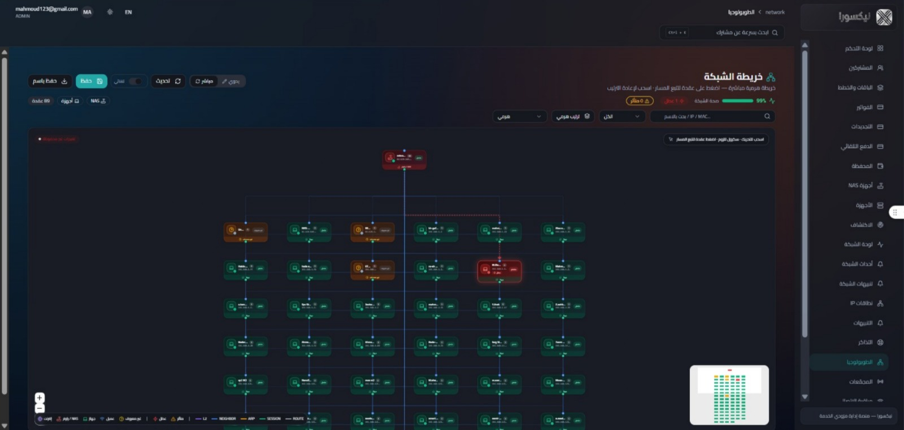

<br/><br/>

### Billing & Subscriptions
*Financial interface detailing customer wallets, pending payments, and auto-renewal states.*

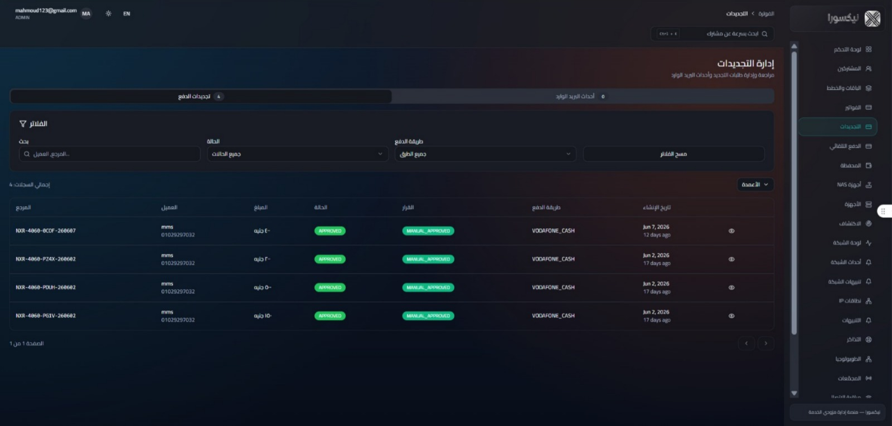
</div>

---

## 📊 Architecture Metrics

<div align="center">

| Metric | Value |
| :--- | :--- |
| **Architecture Style** | Modular Monolith (Domain-Driven, Bounded Contexts) |
| **Primary Backend Framework** | NestJS 10 |
| **Primary Frontend Framework** | Next.js 14 |
| **Languages** | TypeScript, Go, Rust, Kotlin |
| **Core Domain Modules** | Auth, Billing, MikroTik, RADIUS, Topology, Outbox |
| **Authentication Model** | Stateless JWT (Platform / Company / Customer / Device) |
| **Database** | PostgreSQL 16 (Prisma 7 ORM, PgBouncer pooling) |
| **API Style** | REST (NestJS Controllers, `class-validator` DTOs) |
| **Network Integration** | MikroTik RouterOS API, FreeRADIUS `rlm_rest` |
| **Deployment Model** | Docker & Compose, Nginx reverse proxy |
| **Collector Architecture** | Distributed Go/Rust agents, outbound-poll pattern |
| **Tenant Model** | Shared database, row-level isolation via `companyId` |
| **Background Workers** | Daily Billing, Quota Enforcement, Auto-Ping schedulers |
| **Event Processing** | Database-backed transactional outbox (at-least-once delivery) |

</div>

---

## 🏗️ High-Level Architecture

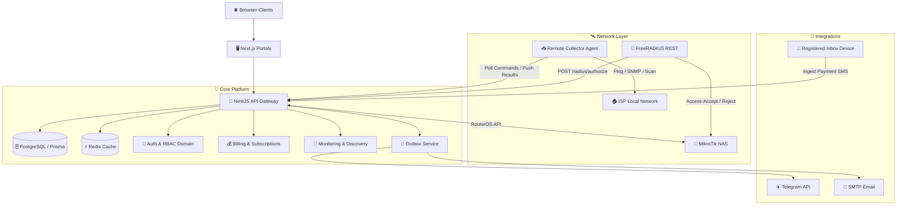

---

## 🧩 System Architecture

| Layer | Responsibility |
| :--- | :--- |
| **Presentation** | Next.js 14 + React 18, React Query, and Zustand. Distinct routing boundaries isolate Platform Owners, ISP Staff, and Customers. |
| **API** | NestJS 10. Handles request ID propagation, CORS boundaries, input validation (`class-validator`), and tenant context extraction. |
| **Business** | Domain services enforcing core logic — SaaS Entitlements, Billing Jobs, Subscription Processors, RADIUS Authorization. |
| **Infrastructure** | Background schedulers for recurring tasks (Daily Billing, Quota Enforcement, Auto-Ping). Database-backed Outbox pattern for durable async execution. |
| **Persistence** | PostgreSQL 16 via Prisma ORM. `JSONB` for extensible config, `Decimal` for exact financial precision. |
| **Network** | `MikrotikApiClientService` for connection pooling and capability probing; Discovery Engine for raw network observations. |
| **Integration** | External webhooks and ingestion endpoints — Telegram bot messaging, SMTP, SMS-based mobile payment parsing. |

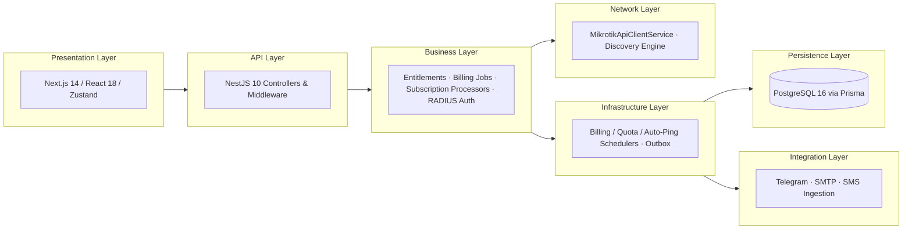

---

## 🚢 Deployment Architecture

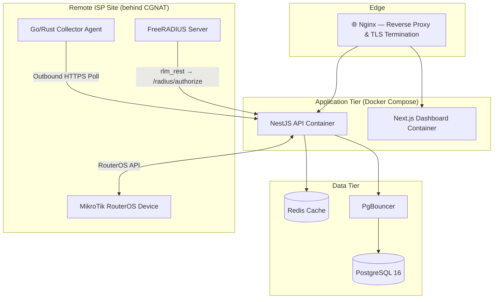

> [!NOTE]
> **Security Note:** The Collector Agent initiates all connections outbound from the ISP site — the platform never requires inbound access to CGNAT'd or firewalled customer networks.

---

## 🔄 Request Lifecycle

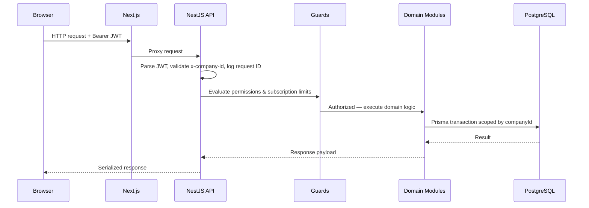

---

## 🔐 Authentication & Authorization

Stateless JWT bearer authentication across partitioned domains prevents privilege escalation.

| Mechanism | Detail |
| :--- | :--- |
| **Authentication Domains** | Distinct JWT payloads for Platform Owners (`type: PLATFORM`), ISP Staff (`companyId` attached), Customers (`type: CUSTOMER`), and Remote Devices. Passwords hashed via `bcrypt`. |
| **Tenant Isolation** | Global `TenantContextMiddleware` extracts the tenant ID from the token and cross-validates it against request headers; mismatches are rejected immediately. |
| **RBAC** | `CompanyRoleType` enums mapped to explicit `CompanyPermission` records via junction tables. |
| **Auditability** | Immutable tracking via `PlatformAuditLog` and `CompanyAuditLog`. Every destructive action records actor ID, entity ID, metadata, impersonation flags, IP, and User-Agent. |

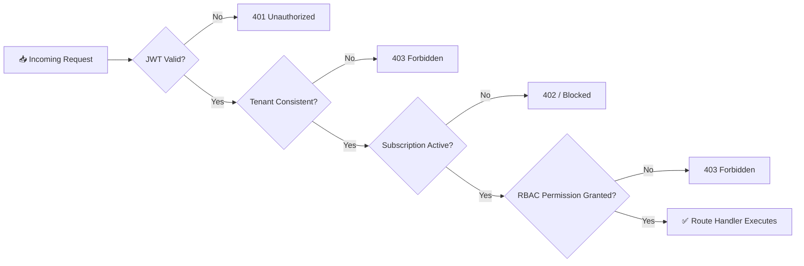

---

## 🏢 Multi-Tenant Architecture

Nexora implements a **shared-database, row-level multi-tenant model** to maximize horizontal scalability. Every operational entity in the schema carries a foreign key relationship to the `Company` record.

The `companyId` is injected into the NestJS request object via perimeter context middleware, so all downstream Prisma queries are strictly scoped — operations from one ISP can never leak into or mutate another ISP's domain.

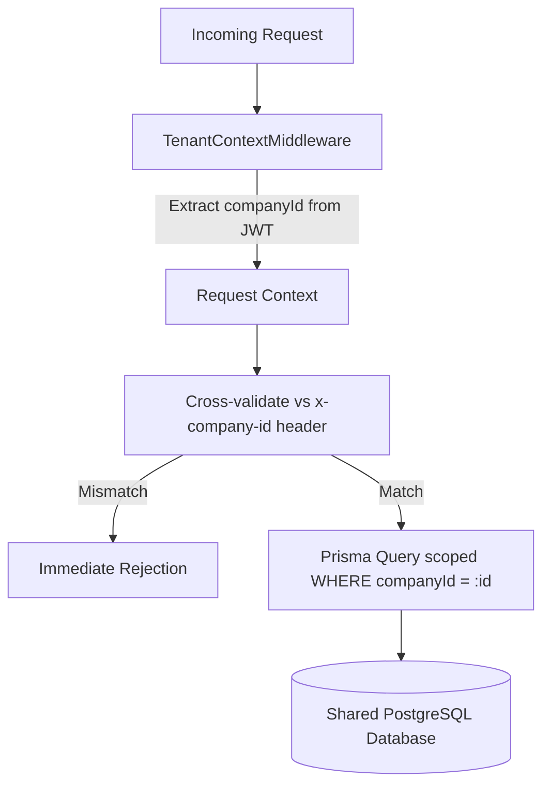

---

## 💳 Billing Engine

| Component | Behavior |
| :--- | :--- |
| **Subscription Lifecycle** | Strict state machine: `Active → Grace → Suspended → Expired`. |
| **Wallet System** | Ledger-based credit balance updated via `CustomerBalanceTxn` records. |
| **Renewal Workflow** | Daily scheduler evaluates pending renewals — debits wallet, extends subscription, resets quota, and unblocks network access if funds are sufficient. |
| **Payment Review** | Offline payments enter a `PENDING` state requiring explicit Cashier approval before affecting subscription state. |

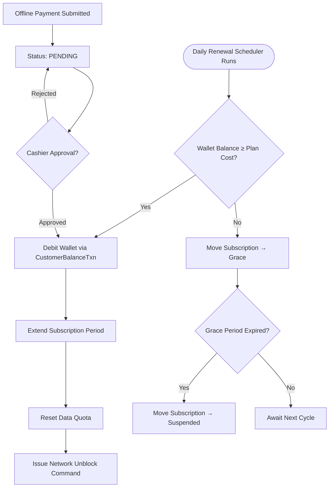

---

## ⏳ Subscription Lifecycle

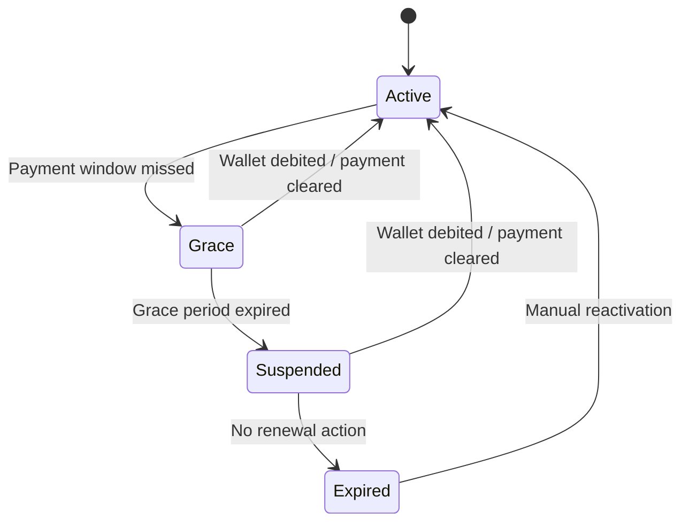

---

## 📶 Quota Enforcement

Usage cycles strictly track subscriber upload and download bytes. A scheduled `QuotaEnforcementService` validates these totals against the `Plan.dataCapBytes` limit. Upon cap exhaustion, the enforcement engine updates the `CustomerNetworkProfile` and applies the configured action, then communicates directly with the router to alter the active Queue or Address List profile.

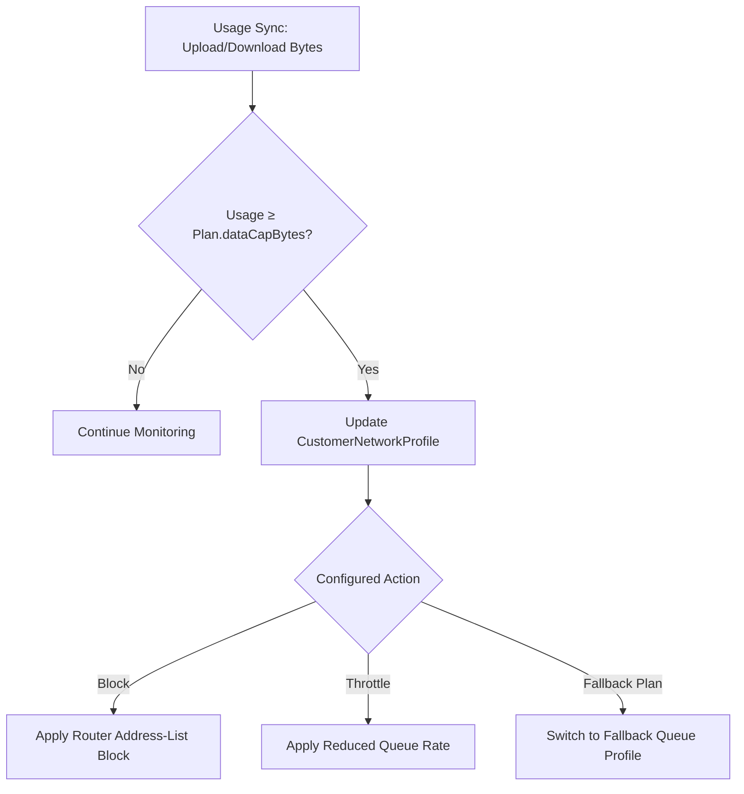

---

## 📡 MikroTik Integration

Nexora acts as the **configuration authority** for connected MikroTik hardware via the RouterOS API.

- `NasRouterOsClientService` — connection pooling for persistent sessions with high-throughput routers.
- `RouterOsCapabilitiesService` — probes each device on connection to detect firmware capabilities (RouterOS v6 vs. v7) and dynamically routes commands through fallback syntax paths.

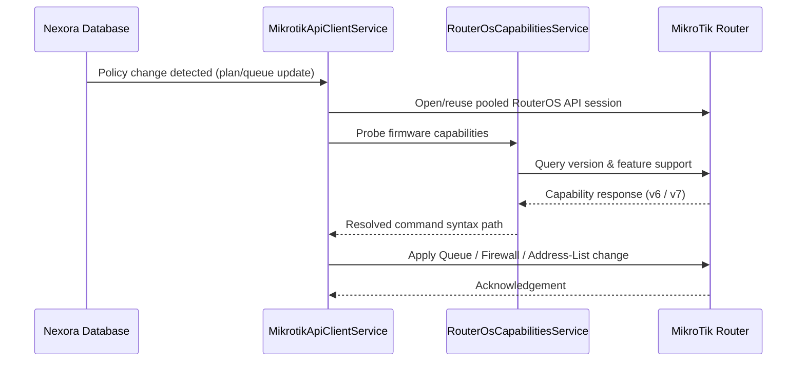

---

## 🧬 FreeRADIUS Integration

Rather than binding directly to the database via `rlm_sql`, Nexora integrates FreeRADIUS through the `rlm_rest` module, centralizing all policy evaluation inside the NestJS business layer.

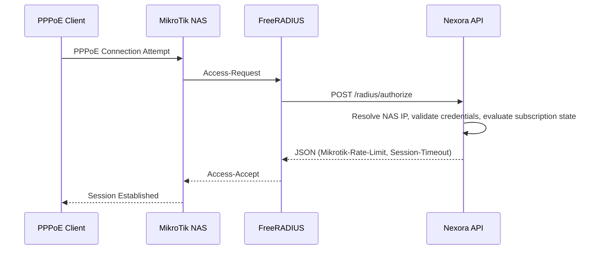

---

## 🗺️ Discovery Engine

The Discovery Engine translates physical network realities into structured application data:

1. Queries MikroTik devices and Remote Collectors for localized network snapshots.
2. Ingests weak telemetry signals — ARP tables, DHCP leases, MNDP/CDP neighbors, PPP sessions, SNMP walks.
3. An algorithmic classifier merges overlapping signals into stable `InventoryDevice` entities.
4. `TopologyBuilderService` derives relationships between devices to generate deterministic graph nodes and edges for UI visualization.

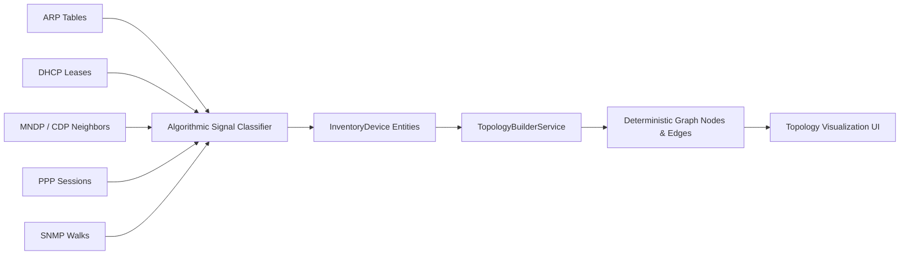

---

## 📥 Collector Architecture

To support ISPs operating behind Carrier-Grade NAT (CGNAT) or complex firewalls, Nexora uses a distributed remote-execution pattern:

| Stage | Description |
| :--- | :--- |
| **Collectors** | Lightweight Go/Rust binaries deployed locally on the ISP's internal network. |
| **Polling** | Collectors maintain an outbound HTTP loop, securely pulling leased `CollectorCommand` payloads — no inbound ports required. |
| **Execution** | Commands (ICMP sweeps, SNMP queries, device discovery) run locally on the LAN. |
| **Results** | Raw execution results and performance metrics are posted back to the platform, updating events and alerting processors. |

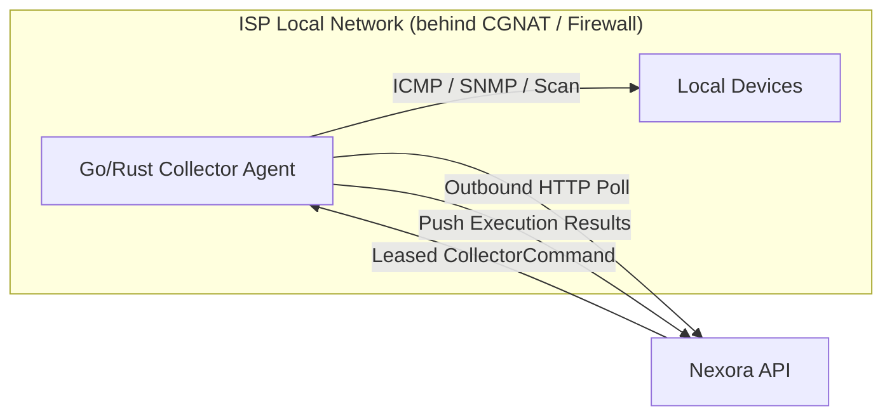

---

## 🛡️ Security Architecture

> [!IMPORTANT]
> Security in Nexora is enforced through layered, sequential checks — no single control is relied upon in isolation.

### Authentication

Strict isolation between Platform, Company, and Customer JWT domains. Distinct payload shapes prevent token reuse across privilege boundaries. Passwords are hashed via `bcrypt`.

### Authorization

Sequential pipeline: **JWT validity → Tenant consistency → Active SaaS subscription → Route-level RBAC permissions.** Fine-grained checks use `CompanyRoleType` enums mapped through explicit `CompanyPermission` junction records.

### Audit Logs

Mandatory, immutable logging of every state mutation via `PlatformAuditLog` and `CompanyAuditLog` — actor ID, entity ID, metadata, impersonation flags, IP address, and User-Agent are recorded for every destructive action.

### Secrets

Machine-to-machine integrations (Collector Agents, remote devices) use one-time enrollment tokens, hashed secrets, and timestamp-validated payloads rather than long-lived static credentials.

### Tenant Isolation

Enforced at the middleware perimeter via `TenantContextMiddleware`, which cross-validates the JWT-embedded tenant ID against request headers before any downstream query executes.

> [!WARNING]
> **Known Limitation:** NAS passwords and notification secrets currently lack explicit KMS envelope encryption at rest, and Collector HMAC authentication relies on hashed secrets and timestamp freshness rather than true asymmetric cryptographic signing. See [Known Limitations](#-known-limitations).

### Future Improvements

- Hardware KMS integration for NAS credential envelope encryption
- Refresh-token rotation and Multi-Factor Authentication (MFA)
- PostgreSQL Row-Level Security (RLS) for defense-in-depth tenant isolation

---

## 🛠️ Technology Stack

<table>
<tr><th>Backend</th><th>Frontend</th></tr>
<tr valign="top">
<td>

| Tech | Role |
| :--- | :--- |
| Node.js 20 | Runtime environment |
| NestJS 10 | Modular enterprise framework |
| TypeScript | Strict typing end-to-end |
| Passport (JWT) | Stateless auth strategy |
| RxJS | Reactive streams & outbox polling |

</td>
<td>

| Tech | Role |
| :--- | :--- |
| Next.js 14 | Server-rendered dashboards |
| React 18 | UI component library |
| Tailwind CSS & Radix | Styling & accessible primitives |
| Zustand & React Query | State management |
| React Flow & Dagre | Topology graph visualization |

</td>
</tr>
<tr><th>Database</th><th>Infrastructure</th></tr>
<tr valign="top">
<td>

| Tech | Role |
| :--- | :--- |
| PostgreSQL 16 | Primary relational datastore |
| Prisma 7 | Type-safe ORM |
| PgBouncer | Lightweight connection pooler |

</td>
<td>

| Tech | Role |
| :--- | :--- |
| Docker & Compose | Containerization & orchestration |
| Nginx | Reverse proxy & TLS termination |
| Redis | In-memory application cache |

</td>
</tr>
<tr><th>Networking</th><th>Languages</th></tr>
<tr valign="top">
<td>

| Tech | Role |
| :--- | :--- |
| MikroTik RouterOS | Network policy enforcement target |
| FreeRADIUS | Centralized AAA management |

</td>
<td>

| Tech | Role |
| :--- | :--- |
| TypeScript | Primary application language |
| Go | Edge Collector Agent binaries |
| Rust | Edge Collector Agent binaries & Tauri shell |
| Kotlin | Native Android application shell |

</td>
</tr>
<tr><th>Desktop</th><th>Mobile</th></tr>
<tr valign="top">
<td>

| Tech | Role |
| :--- | :--- |
| Tauri + Rust | Desktop UI wrapper for Collector agents |

</td>
<td>

| Tech | Role |
| :--- | :--- |
| Kotlin (Android) | Native mobile application shell |

</td>
</tr>
</table>

---

## 📁 Repository Structure

```text
nexora/
├── 📦 apps/
│   ├── 🌐 web/                    # Secondary Next.js application shell
│   └── 🖥️ collector-desktop/      # Tauri + Rust UI wrapper for collector agents
├── 🖥️ isp-dashboard/              # Primary Next.js 14 application
│   ├── app/(platform)/            # SaaS Owner domain routes
│   ├── app/(company)/             # ISP Administrator domain routes
│   └── app/(customer)/            # ISP Subscriber domain routes
├── ⚙️ src/                        # Core NestJS API backend
│   ├── 🔐 auth/                   # JWT strategies and identity controllers
│   ├── 💰 billing/                # State machines, wallet logic, schedulers
│   ├── 📡 mikrotik/               # RouterOS API connection pooling & execution
│   ├── 🧬 radius/                 # FreeRADIUS REST webhook endpoints
│   ├── 🗺️ topology/               # Discovery engine and graph builders
│   └── 🔔 outbox/                 # Durable notification queues
├── 🗄️ prisma/
│   └── schema.prisma               # Database entity relationship definitions
├── ⚙️ config/
│   └── freeradius/                 # rlm_rest and site availability configs
└── 📱 mobile/                      # Native Android application shell (Kotlin)
```

---

## 🧠 Architecture Principles

- **Domain-Driven Design** — bounded contexts (e.g. Billing operates independently from Network Automation).
- **Dependency Injection** — centralized via NestJS for loose coupling and high testability.
- **Separation of Concerns** — distinct boundaries between UI, API, domain logic, and persistence.
- **Modular Architecture** — self-contained modules that minimize cross-domain bleed.
- **Transactional Outbox Pattern** — database-backed queuing for atomic, reliable message delivery.

---

## 📐 Engineering Decisions

<details>
<summary><b>Why NestJS over bare Express</b></summary>
<br/>

| | |
| :--- | :--- |
| **Problem** | Coordinating multiple dense domains in a single codebase without spaghetti logic. |
| **Decision** | Use NestJS. |
| **Reason** | Built-in Dependency Injection and module encapsulation enforce strict bounded contexts and domain isolation. |
| **Trade-offs** | Steeper learning curve, higher boilerplate verbosity. |
| **Impact** | Enabled clean separation between Billing, Auth, MikroTik, RADIUS, and Topology domains as the codebase scaled. |

</details>

<details>
<summary><b>Why PostgreSQL and Prisma</b></summary>
<br/>

| | |
| :--- | :--- |
| **Problem** | Financial tracking mandates strict transactional integrity; SaaS config requires schema flexibility. |
| **Decision** | PostgreSQL via Prisma ORM. |
| **Reason** | PostgreSQL delivers the ACID compliance billing ledgers require; Prisma provides type-safety and strong `JSONB` support for dynamic SaaS limits and payment metadata. |
| **Trade-offs** | Slower migration compilation on very large schemas. |
| **Impact** | Zero financial-precision defects attributable to type coercion since adoption of `Decimal` fields. |

</details>

<details>
<summary><b>Why Shared-Database Multi-Tenancy</b></summary>
<br/>

| | |
| :--- | :--- |
| **Problem** | Isolating data for hundreds of micro-ISPs without exponential infrastructure overhead. |
| **Decision** | Row-level multi-tenancy via `companyId` foreign key. |
| **Reason** | Schema-per-tenant designs bottleneck migrations at scale; row-level isolation maximizes connection-pool utilization. |
| **Trade-offs** | Requires strict middleware-layer discipline to prevent cross-tenant data leakage. |
| **Impact** | Single migration path across all tenants; simplified operational overhead as tenant count grows. |

</details>

<details>
<summary><b>Why REST-based FreeRADIUS (rlm_rest over rlm_sql)</b></summary>
<br/>

| | |
| :--- | :--- |
| **Problem** | Centralized network policy needs real-time business-logic evaluation before granting PPPoE access. |
| **Decision** | Implement FreeRADIUS `rlm_rest` instead of `rlm_sql`. |
| **Reason** | Forcing FreeRADIUS to authenticate via HTTP POST lets the API evaluate dynamic conditions (grace periods, wallet status) and compute bandwidth shapes in real time. |
| **Trade-offs** | Slight added HTTP latency during the PPPoE handshake. |
| **Impact** | Billing state and network access are now guaranteed to be consistent at authentication time. |

</details>

<details>
<summary><b>Why Collector Agents</b></summary>
<br/>

| | |
| :--- | :--- |
| **Problem** | The central SaaS platform cannot reach ISP hardware behind enterprise firewalls or CGNAT. |
| **Decision** | Deploy compiled Go/Rust agents inside the ISP's local network. |
| **Reason** | Outbound HTTP polling entirely bypasses the need for inbound port forwarding. |
| **Trade-offs** | Increased distribution complexity; requires remote update mechanisms across multiple architectures. |
| **Impact** | Enabled full topology discovery and monitoring for ISPs with zero public IP exposure. |

</details>

<details>
<summary><b>Why Database-Backed Outbox (instead of Redis)</b></summary>
<br/>

| | |
| :--- | :--- |
| **Problem** | Critical alerts and webhooks must survive restarts without losing state or duplicating delivery. |
| **Decision** | Use PostgreSQL tables (`NotificationOutbox`, `TelegramOutbox`) for queuing. |
| **Reason** | Writing outbox records in the same transaction as business logic guarantees atomicity; polling workers ensure zero data loss without adding infrastructure. |
| **Trade-offs** | Higher load on the primary database from constant polling. |
| **Impact** | Zero reported notification loss since adoption, at the cost of additional read load on Postgres. |

</details>

---

## 🧗 Engineering Challenges Solved

<table>
<tr>
<td width="50%" valign="top">

### ⚡ Financial State → Network Enforcement
Bridging slow human timeframes (monthly billing cycles) with millisecond-level network operations required designing a robust asynchronous enforcement scheduler capable of translating semantic states (`"Active"`) into concrete RouterOS queue alterations.

</td>
<td width="50%" valign="top">

### 🔀 RouterOS Version Compatibility
Managing physical hardware fleets running distinct RouterOS versions (v6 vs. v7) required building a capability-probing abstraction layer that dynamically rewrites commands based on the target router's detected firmware.

</td>
</tr>
<tr>
<td width="50%" valign="top">

### 💸 Offline Payment Matching
Processing regional, non-API payment rails (Vodafone Cash, InstaPay) was solved by deploying Android edge devices to ingest raw SMS notifications, using heuristic text parsing to probabilistically match transaction references to pending invoices.

</td>
<td width="50%" valign="top">

### 🌐 Distributed Collectors Behind NAT
Solved inbound accessibility constraints by reversing the communication vector — distributed Go/Rust nodes perform outbound HTTP polling against the central command queue.

</td>
</tr>
<tr>
<td width="50%" valign="top">

### 📊 Quota Enforcement Accuracy
Ensuring accurate data cap limits required building high-frequency sync aggregators capable of pulling PPPoE session bytes and issuing live network blocks without generating race conditions.

</td>
<td width="50%" valign="top">

</td>
</tr>
</table>

---

## 🗺️ Roadmap

- [ ] Hardware Key Management Service (KMS) integration for NAS credential envelope encryption
- [ ] Direct payment gateway API integrations
- [ ] Multi-region High Availability (HA) deployment configurations
- [ ] Comprehensive OpenTelemetry and Prometheus metric exposure
- [ ] Refresh-token rotation and Multi-Factor Authentication (MFA)
- [ ] PostgreSQL Row-Level Security (RLS) implementation for defense-in-depth tenant isolation

---

## ⚠️ Known Limitations

> [!WARNING]
> **Source Code is Private** — this repository is an architectural showcase; proprietary logic is withheld.

> [!WARNING]
> **Credential Storage** — NAS passwords and notification secrets currently lack explicit KMS envelope encryption at rest.

> [!WARNING]
> **Payment Automations** — integrations rely heavily on SMS/inbox parsing rather than direct SDK gateway connections.

> [!WARNING]
> **Secret Verification** — Collector HMAC authentication relies on hashed secrets and timestamp freshness rather than true asymmetric cryptographic signing.

> [!WARNING]
> **Schemas** — legacy tenant schemas and the primary SaaS `Company` schema currently coexist, pending consolidation.

---

## 🚫 Non-Goals

This repository intentionally does **not** include:

- Production source code
- Proprietary commercial logic or algorithms
- Infrastructure credentials or `.env` files
- Customer, tenant, or financial data
- Internal deployment automation scripts

---

## 📊 Project Status

<div align="center">

| | |
| :--- | :--- |
| **Stage** | Commercial product — active development |
| **Source** | Strictly private |
| **This Repository** | Architectural showcase & engineering portfolio |

</div>

---

## 🔒 Commercial Notice

> [!IMPORTANT]
> To protect commercial intellectual property, no actual backend source code, sensitive implementation details, proprietary algorithms, or deployable binaries are included in this repository.

---

## 👤 About the Author

<div align="center">

**Abdalrahman Taher**
*Backend Engineer*

Interested in Backend Engineering · Distributed Systems · ISP Infrastructure · Network Automation · System Architecture

[](mailto:bedotaher2005@gmail.com)
[](https://github.com/Abdalrahman-taher)
[](#)
[](#)

</div>
